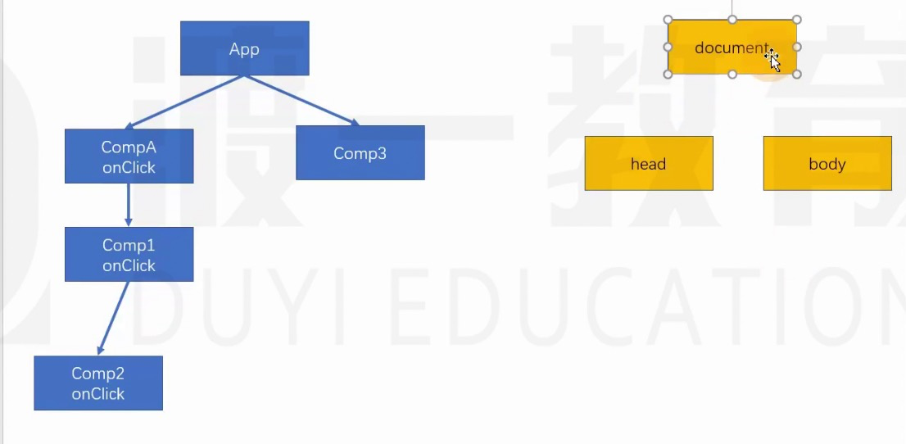

# React中的事件

这里的事件：React内置的DOM组件中的事件

1. 几乎所有的元素的事件处理，均在document的事件中处理，React会根据虚拟DOM树的完成事件函数的调用
   1. 一些不冒泡的事件，是直接在元素上监听
   2. 一些document上面没有的事件，直接在元素上监听
   3. 如果给真实的DOM注册事件，阻止了事件冒泡，则会导致react的相应事件无法触发(和第三方dom插件混用是需要特别注意)
   4. 如果给真实的DOM注册事件，事件会先于React事件运行
2. React的事件参数，并非真实的DOM事件参数，是React合成的一个对象，该对象类似于真实DOM的事件参数
   1. e.stopPropagation,通过React的事件中阻止事件冒泡，无法阻止真实的DOM事件冒泡,阻止事件在虚拟DOM树中冒泡（demo1）
   2. nativeEvent，可以得到真实的DOM事件对象
   3. 可以通过e.nativeEvent.stopImmediatePropagation()，阻止document上剩余事件的执行
   4. 为了提高执行效率，React使用事件对象池来处理事件，事件事件中e是同一个
   5. 在事件处理程序中，不要异步的使用事件对象。如果一定要使用，需要调用persist函数

   ```js
for (const handler of eventHandlers) {
  handler(e);
  if (e.isStopped) {
    break;
  }
}
```

#### 虚拟dom和真实dom



